# Soap Bubble Simulation

Physically accurate 3D soap bubble simulation in Rust with GPU-accelerated visualization. The simulation models thin-film interference colors, drainage dynamics, and real-time parameter adjustment.


## Features

- **Thin-film interference rendering** - Realistic iridescent colors based on optical physics
- **Real-time GPU rendering** - wgpu-based pipeline with Vulkan/Metal/DX12 support
- **Interactive controls** - egui-based UI for adjusting simulation parameters
- **Orbit camera** - Mouse-controlled camera with zoom and rotation
- **Configurable parameters** - Film thickness, refractive index, opacity, mesh detail

## Physics Background

### Thin-Film Interference

The iridescent colors of soap bubbles arise from light interference at the thin film surfaces. When light hits the soap film:

1. Part reflects from the outer surface
2. Part transmits, reflects from the inner surface, and exits
3. These two waves interfere constructively or destructively depending on:
   - Film thickness `d`
   - Viewing angle `θ`
   - Light wavelength `λ`

**Optical path difference:**

```
δ = 2 n_film d cos(θ_t) + λ/2
```

Where:
- `n_film` = Refractive index of soap film (~1.33)
- `d` = Film thickness (typically 100-1000 nm)
- `θ_t` = Transmission angle in film (from Snell's law)
- `λ/2` = Phase shift from reflection at denser medium

The simulation computes interference intensity for RGB wavelengths (650nm, 532nm, 450nm) and combines with Fresnel reflection using Schlick's approximation.

### Drainage

The film thickness varies across the bubble surface due to gravity. The top drains faster, becoming thinner, while fluid accumulates at the bottom. This is modeled using the normal vector's Y-component to create realistic thickness gradients.

## Installation

### Prerequisites

- Rust 1.75+ (2024 edition)
- GPU with Vulkan, Metal, or DX12 support
- For WSL2: X11 server (VcXsrv, X410, or WSLg)

### Build

```bash
# Clone the repository
git clone https://github.com/pjt222/soap_bubble_simulation.git
cd soap_bubble_simulation

# Debug build
cargo build

# Release build (recommended for performance)
cargo build --release
```

## Usage

### Running the Simulation

```bash
# Default parameters
cargo run --release

# With custom config file
cargo run --release -- --config path/to/config.json

# Override specific parameters
cargo run --release -- --thickness 600 --diameter 0.08
```

### WSL2 / WSLg Users

WSLg (Windows Subsystem for Linux GUI) is recommended for running the simulation on Windows.

```bash
# Recommended: Run with WSLg (Wayland) - requires XDG_RUNTIME_DIR
XDG_RUNTIME_DIR=/mnt/wslg/runtime-dir cargo run --release

# Alternative: Force X11 backend (if Wayland fails)
WAYLAND_DISPLAY= WINIT_UNIX_BACKEND=x11 cargo run --release

# If WSLg isn't available, use an X server (VcXsrv, X410):
export DISPLAY=$(cat /etc/resolv.conf | grep nameserver | awk '{print $2}'):0
cargo run --release
```

**Note:** WSLg uses software rendering (llvmpipe) which may cause occasional connection drops. If the app crashes unexpectedly, simply restart it.

### Controls

| Input | Action |
|-------|--------|
| Left mouse drag | Orbit camera around bubble |
| Mouse wheel | Zoom in/out |
| Escape | Exit application |

### UI Controls

The egui panel provides real-time adjustment of:

- **Film Thickness** (100-1000 nm) - Controls base interference colors
- **Refractive Index** (1.0-2.0) - Affects color intensity and shift
- **Color Intensity** (0.5-10.0) - Amplifies interference visibility
- **Base Opacity** (0.0-1.0) - Transparency when viewing straight-on
- **Edge Opacity** (0.0-1.0) - Transparency at glancing angles (Fresnel effect)
- **Mesh Detail** (1-5) - Subdivision level of sphere mesh
- **Background Color** - RGB color picker

## Configuration

Parameters can be set via JSON configuration file:

```json
{
  "bubble": {
    "diameter": 0.05,
    "film_thickness_nm": 500.0,
    "critical_thickness_nm": 10.0,
    "refractive_index": 1.33
  },
  "fluid": {
    "viscosity": 0.001,
    "surface_tension": 0.025,
    "density": 1000.0,
    "surfactant_diffusion": 1e-9,
    "surfactant_concentration": 0.5
  },
  "resolution": 128
}
```

## Architecture

```mermaid
---
title: Soap Bubble Simulation Data Flow
---
flowchart TD
    cfg_default["Default config"]
    cfg_from_file["Parse JSON config"]
    io_png_export["Write PNG file"]
    cli_parse_args["Parse CLI arguments"]
    cfg_load["Load config JSON"]
    cfg_merge_cli["Merge CLI overrides"]
    cli_event_loop["Run event loop"]
    cpu_drainage_step["CPU drainage step"]
    cpu_thickness_query["Query thickness field"]
    cpu_foam_system["Foam bubble system"]
    cpu_foam_dynamics["Foam physics step"]
    cpu_foam_gen["Generate foam cluster"]
    cpu_icosphere_gen["Generate icosphere mesh"]
    cpu_lod_cache["LOD mesh cache"]
    cpu_patch_gen["Generate sphere patch"]
    cpu_interference_ref["CPU interference reference"]
    gpu_compute_branched_init["Init branched flow"]
    gpu_compute_branched_step["Dispatch branched flow rays"]
    cpu_camera_state["Camera view-projection"]
    gpu_compute_caustics["Caustic compute + render"]
    gpu_render_foam["Foam instanced renderer"]
    gpu_compute_drainage["GPU drainage compute"]
    gpu_render_headless["Headless test renderer"]
    cpu_lut_gen["Generate interference LUT"]
    gpu_init_device["Initialize GPU device"]
    gpu_init_uniforms["Upload uniforms to GPU"]
    gpu_init_lut_upload["Upload interference LUT"]
    gpu_init_mesh_upload["Upload mesh to GPU"]
    gpu_compute_dispatch["Dispatch compute shaders"]
    gpu_render_pass["Render bubble pass"]
    gpu_render_egui["Render egui overlay"]
    io_export_frame["Export frame to PNG"]
    gpu_render_bubble_vs["Bubble vertex shader"]
    gpu_render_bubble_fs["Bubble fragment shader"]
    gpu_compute_branched_shader["Branched flow ray trace"]
    gpu_compute_drainage_shader["Drainage PDE solver"]
    gpu_render_instanced["Instanced foam shader"]
    gpu_render_caustics["Caustic render shader"]
    gpu_compute_caustics_shader["Caustic intensity compute"]
    gpu_render_wall["Plateau border shader"]

    %% Connections
    cfg_load --> cfg_from_file
    gpu_render_egui --> io_png_export
    cli_parse_args --> cfg_load
    cfg_load --> cfg_merge_cli
    cfg_default --> cli_event_loop
    cfg_from_file --> cli_event_loop
    cfg_merge_cli --> cli_event_loop
    cfg_default --> cpu_drainage_step
    cfg_from_file --> cpu_drainage_step
    cfg_merge_cli --> cpu_drainage_step
    cpu_drainage_step --> cpu_thickness_query
    cpu_thickness_query --> cpu_thickness_query
    cfg_default --> cpu_foam_system
    cfg_from_file --> cpu_foam_system
    cfg_merge_cli --> cpu_foam_system
    cpu_foam_system --> cpu_foam_dynamics
    cpu_foam_dynamics --> cpu_foam_dynamics
    cpu_foam_gen --> cpu_foam_dynamics
    cfg_default --> cpu_foam_gen
    cfg_from_file --> cpu_foam_gen
    cfg_merge_cli --> cpu_foam_gen
    cfg_default --> cpu_icosphere_gen
    cfg_from_file --> cpu_icosphere_gen
    cfg_merge_cli --> cpu_icosphere_gen
    cfg_default --> cpu_lod_cache
    cfg_from_file --> cpu_lod_cache
    cfg_merge_cli --> cpu_lod_cache
    cfg_default --> cpu_patch_gen
    cfg_from_file --> cpu_patch_gen
    cfg_merge_cli --> cpu_patch_gen
    cfg_default --> cpu_interference_ref
    cfg_from_file --> cpu_interference_ref
    cfg_merge_cli --> cpu_interference_ref
    gpu_init_device --> gpu_compute_branched_init
    cpu_camera_state --> gpu_compute_branched_step
    gpu_init_uniforms --> gpu_compute_branched_step
    cli_event_loop --> cpu_camera_state
    gpu_compute_drainage --> gpu_compute_caustics
    gpu_compute_dispatch --> gpu_compute_caustics
    gpu_compute_drainage_shader --> gpu_compute_caustics
    gpu_compute_caustics_shader --> gpu_compute_caustics
    cpu_foam_system --> gpu_render_foam
    cpu_foam_dynamics --> gpu_render_foam
    cpu_foam_gen --> gpu_render_foam
    cpu_camera_state --> gpu_compute_drainage
    gpu_init_uniforms --> gpu_compute_drainage
    cfg_default --> gpu_render_headless
    cfg_from_file --> gpu_render_headless
    cfg_merge_cli --> gpu_render_headless
    cfg_default --> cpu_lut_gen
    cfg_from_file --> cpu_lut_gen
    cfg_merge_cli --> cpu_lut_gen
    cfg_default --> gpu_init_device
    cfg_from_file --> gpu_init_device
    cfg_merge_cli --> gpu_init_device
    gpu_init_device --> gpu_init_uniforms
    gpu_init_device --> gpu_init_lut_upload
    gpu_init_device --> gpu_init_mesh_upload
    cpu_camera_state --> gpu_compute_dispatch
    gpu_init_uniforms --> gpu_compute_dispatch
    gpu_compute_drainage --> gpu_render_pass
    gpu_compute_dispatch --> gpu_render_pass
    gpu_compute_drainage_shader --> gpu_render_pass
    gpu_compute_caustics_shader --> gpu_render_pass
    gpu_compute_caustics --> gpu_render_egui
    gpu_render_foam --> gpu_render_egui
    gpu_render_headless --> gpu_render_egui
    gpu_render_pass --> gpu_render_egui
    gpu_render_bubble_vs --> gpu_render_egui
    gpu_render_bubble_fs --> gpu_render_egui
    gpu_render_instanced --> gpu_render_egui
    gpu_render_caustics --> gpu_render_egui
    gpu_render_wall --> gpu_render_egui
    gpu_render_egui --> io_export_frame
    cpu_icosphere_gen --> gpu_render_bubble_vs
    cpu_lod_cache --> gpu_render_bubble_vs
    cpu_patch_gen --> gpu_render_bubble_vs
    gpu_init_mesh_upload --> gpu_render_bubble_vs
    cpu_lut_gen --> gpu_render_bubble_fs
    gpu_init_lut_upload --> gpu_render_bubble_fs
    cpu_camera_state --> gpu_compute_branched_shader
    gpu_init_uniforms --> gpu_compute_branched_shader
    cpu_camera_state --> gpu_compute_drainage_shader
    gpu_init_uniforms --> gpu_compute_drainage_shader
    cpu_icosphere_gen --> gpu_render_instanced
    cpu_lod_cache --> gpu_render_instanced
    cpu_patch_gen --> gpu_render_instanced
    gpu_init_mesh_upload --> gpu_render_instanced
    gpu_compute_drainage --> gpu_render_caustics
    gpu_compute_dispatch --> gpu_render_caustics
    gpu_compute_drainage_shader --> gpu_render_caustics
    gpu_compute_caustics_shader --> gpu_render_caustics
    gpu_compute_drainage --> gpu_compute_caustics_shader
    gpu_compute_dispatch --> gpu_compute_caustics_shader
    gpu_compute_drainage_shader --> gpu_compute_caustics_shader
    gpu_compute_caustics_shader --> gpu_compute_caustics_shader
    cpu_icosphere_gen --> gpu_render_wall
    cpu_lod_cache --> gpu_render_wall
    cpu_patch_gen --> gpu_render_wall
    gpu_init_mesh_upload --> gpu_render_wall
```

<!-- PUTIOR-WORKFLOW-START -->

<!-- PUTIOR-WORKFLOW-END -->

*Generated with [putior](https://github.com/pjt222/putior) — regenerate with `Rscript scripts/generate_workflow.R`*

## Project Structure

```
soap-bubble-sim/
├── src/
│   ├── main.rs              # Entry point, winit event loop, CLI
│   ├── lib.rs               # Library exports
│   ├── config.rs            # SimulationConfig, parameter structs
│   ├── physics/
│   │   ├── geometry.rs      # UV sphere mesh generation
│   │   ├── drainage.rs      # Film thickness dynamics
│   │   └── interference.rs  # Color computation (CPU reference)
│   ├── render/
│   │   ├── pipeline.rs      # wgpu setup, buffers, egui integration
│   │   ├── camera.rs        # Orbit camera with zoom/pan
│   │   └── shaders/
│   │       └── bubble.wgsl  # Thin-film interference shader
│   └── export/
│       └── image_export.rs  # PNG export functionality
└── config/
    └── default.json         # Default parameters
```

## Key Development Insights

### UV Sphere vs Icosphere

Initially, an icosphere mesh was used, but this caused visible **zigzag seam artifacts** at the equator due to UV coordinate discontinuities. The solution was twofold:

1. **Switch to UV sphere** - Regular latitude/longitude grid with proper UV wrapping
2. **Use normal vectors for thickness** - Instead of UV coordinates, the shader uses the interpolated normal vector to compute film thickness, which is continuous across the entire sphere

### WGSL Struct Alignment

A critical issue arose with uniform buffer size mismatch between Rust and WGSL:

- WGSL's `vec3<f32>` has **16-byte alignment**, inflating struct size
- Rust's `[f32; 3]` has only **4-byte alignment**

**Solution:** Use separate `f32` padding fields instead of `vec3<f32>`:

```wgsl
// Instead of: _padding: vec3<f32>
_padding1: f32,
_padding2: f32,
_padding3: f32,
```

### egui Depth Buffer Configuration

When integrating egui with a 3D scene using depth testing:

- The egui renderer's depth format must match the render pass configuration
- Either both use `Some(Depth32Float)` or both use `None`
- Mismatch causes validation errors at runtime

### Instanced Rendering for Foam Bubbles

When implementing GPU instancing for multi-bubble foam rendering, several issues arose:

**Double-scaling bug:** The foam bubbles rendered at ~1/40th their correct size because:
- The vertex buffer mesh had radius 0.025m (from LodMeshCache)
- The instance model matrix applied another scale of 0.025
- Result: 0.025 × 0.025 = 0.000625m (nearly invisible)

**Solution:** Create a dedicated **unit sphere mesh** (radius 1.0) for instanced rendering, so the model matrix scale works correctly.

**Shader parity:** The instanced shader must match the single-bubble shader exactly:
- Use the same **simplex noise** implementation (not simplified hash-based noise)
- Use `bubble.film_time` (not `bubble.time`) for film dynamics animation
- Use **7-point spectral sampling** with CIE color matching (not 3-wavelength RGB)
- Use **reflected** Airy intensity formula: `I = F·sin²(δ/2) / (1 + F·sin²(δ/2))`
  - Not transmitted: `I = 1 / (1 + F·sin²(δ/2))` which produces nearly uniform colors

**Instance data:** Each bubble passes its own `thickness_nm` and `refractive_index` via instance attributes, while shared parameters (`film_time`, `swirl_intensity`, `drainage_speed`, `pattern_scale`) come from the uniform buffer.

## References

### Thin-Film Optics

- Born, M. & Wolf, E. (1999). *Principles of Optics* (7th ed.). Cambridge University Press.
  - Chapter 7: Interference and diffraction with partially coherent light
  - Chapter 13: Optics of metals and thin films

- Macleod, H. A. (2010). *Thin-Film Optical Filters* (4th ed.). CRC Press.
  - Comprehensive treatment of interference in thin films

### Soap Bubble Physics

- Isenberg, C. (1992). *The Science of Soap Films and Soap Bubbles*. Dover Publications.
  - Classic reference for soap film geometry and physics

- de Gennes, P.-G., Brochard-Wyart, F., & Quéré, D. (2004). *Capillarity and Wetting Phenomena*. Springer.
  - Chapter on thin liquid films and drainage

### Fresnel Equations

- Schlick, C. (1994). "An Inexpensive BRDF Model for Physically-based Rendering." *Computer Graphics Forum*, 13(3), 233-246.
  - The Schlick approximation used in this simulation

### GPU Rendering

- wgpu Documentation: https://wgpu.rs/
- Learn WGPU Tutorial: https://sotrh.github.io/learn-wgpu/

### Related Research

- Glassner, A. (2000). "Soap Bubbles: Part 1 & 2." *IEEE Computer Graphics and Applications*, 20(5-6).
  - Rendering techniques for soap bubbles

- Patsyk, A., et al. (2020). "Observation of branched flow of light." *Nature*, 583, 60-65.
  - DOI: [10.1038/s41586-020-2376-8](https://doi.org/10.1038/s41586-020-2376-8)
  - Experimental observation of light patterns in soap films

- Huang, W., et al. (2020). "Chemomechanical simulation of soap film flow on spherical bubbles." *ACM Transactions on Graphics*, 39(4).
  - Advanced simulation of soap film dynamics

- Meng, X., Piazza, F., Both, G. J., Barzel, B., & Barabási, A.-L. (2026). "Surface optimization governs the local design of physical networks." *Nature*, 649, 315-322.
  - DOI: [10.1038/s41586-025-09784-4](https://doi.org/10.1038/s41586-025-09784-4)
  - Mathematical framework connecting surface minimization to network physics

## License

MIT License - see [LICENSE](LICENSE) for details.

## Author

Philipp Thoss (ph.thoss@gmx.de)

## Acknowledgments

- [wgpu](https://wgpu.rs/) - Cross-platform GPU abstraction
- [egui](https://github.com/emilk/egui) - Immediate mode GUI
- [winit](https://github.com/rust-windowing/winit) - Window creation and event handling
